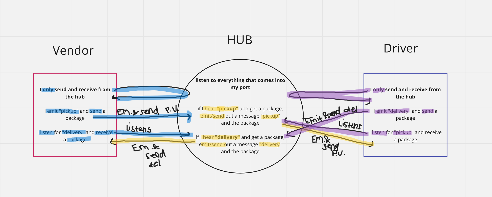

## CAPS: Code Academy Parcel Service

### Project: CAPS
### Author: Stacy Yu
### Links and Resources
- [Pull Request](https://github.com/stacyyuu/CAPS/pull/3)

### Setup
- Uses chance, EventEmitter, Jest 

### How to initialize/run your application (where applicable)
- npm start

### How to use your library (where applicable)

### Tests
- Jest
- Node.yml on GitHub

### UML
- N/A

### Notes

- Server sets up connection
- Events happen with our methods 

- Npm install chance, lets you generate random stuff
- chance.city();
- chance.guid();
- chance.name();
- chance.address();

- Send event, need an event emitter 
- Npm install @ types/node
- Emits handler takes up to parameters, event & argument 
- Need someone to listen to event 
- Events.on(name of event, function to handle event)
- For testing, use mock implementation
- spyOn emit method 
- Have an object that holds all events so that we can use that - variable to access the deliver and pickup events
